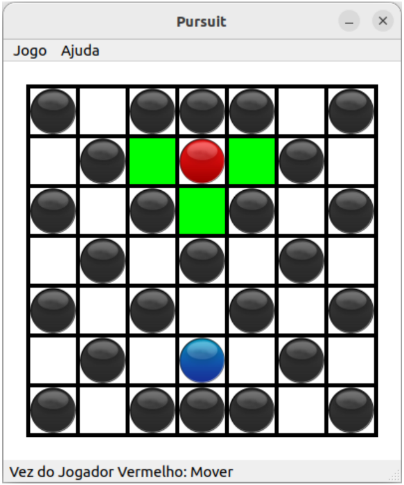

# LPTP2_Pursuit
Trabalho Prático 2 - Linguagens de Programação

Este projeto consiste na implementação de um [jogo](https://youtu.be/MScOazcEfH0) de tabuleiro fundamentado em um sistema de perseguição feito no framework Qt em C++ visando a prática dos conceitos de programação orientada a eventos.

Autores: 
* Caio Rangel Nunes 
* Emanuel Victor Fonseca

